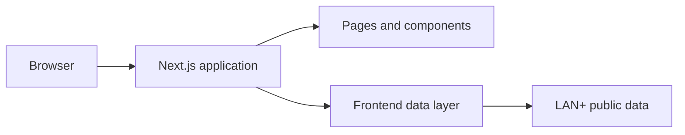

# Frontend Architecture

## Overview

The LAN+ website is a Next.js application using the App Router. Contributors
work only in this repository; running or configuring the LAN+ backend is not
part of the normal frontend workflow.

External data access is kept behind the frontend data layer:

- `app/api/public/*` contains route handlers used by browser code.
- `lib/public-api.ts` contains shared profile fetching and public data types.
- Pages and components should use those existing boundaries.

## Current page behavior

- `/worlds` is a client-rendered page because it refreshes the public world list while the page is open.
- `/profile/[friendCode]` is server-rendered and displays either a public profile, a not-found page, or an unavailable state.
- Pages that depend on public data must handle loading, empty, unavailable, and not-found states where applicable.

## Contribution boundary

Contributions may change pages, components, styles, accessibility, copy, and the handling of documented response fields.
Changes to backend services, deployment, DNS, authentication, or server infrastructure are outside this repository's scope.